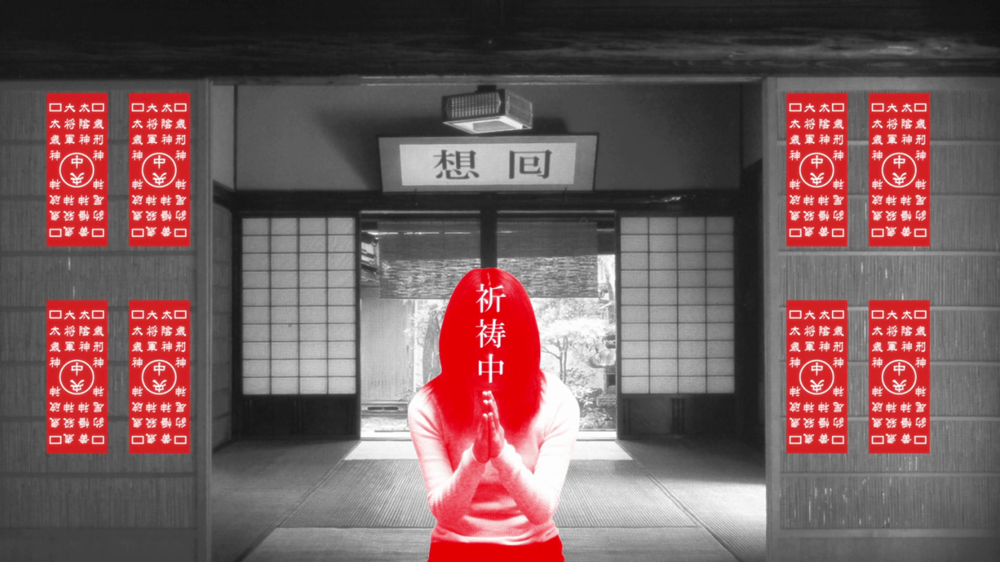
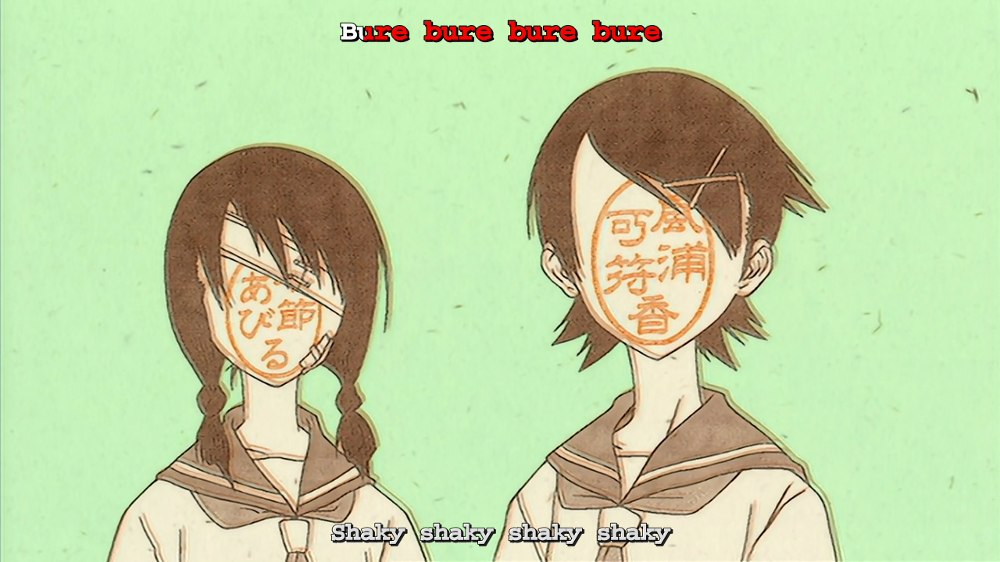
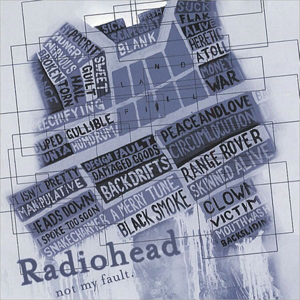

# 若画面有语言 - 浅分析 KaoNoKotoba 项目

> 彼は最早や芙蓉のなきがらと別れるに忍びなかった。彼女なしには生きて行くことは考えられなかった。この土蔵の厚い壁の中の別世界で、彼女のむくろと二人ぽっちで、いつまでも、不可思議な恋にひたっていたかった。そうする外には何の思案も浮ばなかった。「永久に……」と彼は何心なにごころなく考えた。だが、「永久」という言葉に含まれた、ある身の毛もよだつ意味に思い当った時、彼は余りの怖さに、ピョコンと立上って、いきなり部屋の中を、忙し相に歩き始めた。一刻も猶予のならぬことだった。だが、どんなに急いでも慌てても、彼には（恐らく神様にだって）どうすることも出来ないのだ。
>「蟲、蟲、蟲、蟲、蟲、蟲、蟲、蟲、蟲、蟲、蟲、蟲、蟲、蟲、蟲、蟲、蟲、蟲、蟲、蟲、蟲、蟲、蟲、蟲、蟲、蟲、蟲、蟲、蟲、蟲、蟲、蟲、蟲、蟲、蟲、蟲、蟲、蟲、蟲、蟲、蟲、蟲、蟲、ゝゝゝゝゝゝゝゝゝゝ」
>　彼の白い脳髄の襞ひだを、無数の群蟲ぐんちゅうが、ウジャウジャ這い廻った。あらゆるものを啖くらいつくす、それらの微生物の、ムチムチという咀嚼そしゃくの音が、耳鳴りの様に鳴り渡った。

--<cite>江户川乱步 《虫》</cite>

> 「僕は本当は羽川のことが大嫌いなんだからね」
> 「そう。私も本当は阿良々木くんのこと、大嫌いなんだからね」
> 言って、羽川は。
> 「死んじゃえ」
> その視線を僕から外し、侮蔑するように──消え入るような小さな声で呟く。
>
> 「死んじゃえ、死んじゃえ、死んじゃえ、死んじゃえ、死んじゃえ、死んじゃえ、死んじゃえ、死んじゃえ、死んじゃえ、死んじゃえ、死んじゃえ、死んじゃえ、死んじゃえ、死んじゃえ、死んじゃえ、死んじゃえ、死んじゃえ、死んじゃえ、死んじゃえ、死んじゃえ、死んじゃえ、死んじゃえ、死んじゃえ、死んじゃえ、死んじゃえ、死んじゃえ、死んじゃえ、死んじゃえ、死んじゃえ、死んじゃえ、死んじゃえ、死んじゃえ、死んじゃえ、死んじゃえ、死んじゃえ、死んじゃえ、死んじゃえ、... 死んじゃえ、死んじゃえ、──私にゃんて、死んじゃえ」
>
> にゃおん、と。
> 羽川は猫のように言って──再び、四つん這いの姿を取った。
> 形状変化した爪が二十本、コンクリートの床に食い込んでいる。この前、教室でも似たようなことをしていたけれど、猫の爪というのは、そう言えば、出し入れが自由なんだっけ？

--<cite>西尾維新 《猫物語（黑）》</cite>

《哈利波特》中令人尊敬的导师阿不思·邓布利多说过，*语言是最取之不尽的魔力源泉。*

在探索文字与图像的交织之美时，我们不禁被汉字这一独特的象形文字所吸引。汉字，作为一种视觉符号，既具有其独立的意义，又能作为更广泛语言体系中的一部分，承载着丰富的语义。这种独特的双重特性，使得汉字成为文学创作中的一种强大工具，尤其在日本文学中，无论是经典作品还是现代流行文化，例如轻小说和动画，都广泛采用重复文字作为“文字墙”，以增强表达力。

考虑到江户川乱步的《虫》和西尾维新的《猫物語（黑）》，我们可以看到文字墙在文学中的巧妙运用。在乱步的作品中，重复的“蟲”字形成了一面令人毛骨悚然的文字墙，而西尾的文本则通过连续五页的重复内容，创造出一种紧张而戏剧性的氛围。这些例子展示了如何通过重复单一文字或短句来增强情感表达和视觉冲击。

走在动画领域前端的创作人物，如新房昭之、尾石达也、庵野秀明等，也喜欢运用意识流的手法，甚至将汉字直接作为动画图像的一部分。这种创意表达不仅令人印象深刻，也挑战了传统的视觉艺术表现形式。例如，在某些场景中，动画中的人物或对象被抽象化为由汉字构成的图像，这些汉字不仅代表了它们的直接含义，也构成了整体的视觉景象。


*『偽物語』片头曲「二言目」画面，使用重复的文字墙文字作为背景图案，人物则用特征鲜明的剪影表现。*



*『化物語』「ひたぎクラブ」章节，以及『さよなら絶望先生』片头曲「人として轴がぶれている」画面，使用文字代替人物面部特征。*


*『化物語』「ひたぎクラブ」章节，以及『化物語』「なでこスネイク」章节画面，使用文字的组合来表现抽象的内容，比如螃蟹的神明和蛇神的鳞片。*


*『物語シリーズ』常见的纯色画面，搭配简约的文字（台词，或上下文没有关联的色彩帧），模仿上世纪无声电影中插入台词的方式，增强画面的表现力。*


*『さよなら絶望先生』片头曲「人として轴がぶれている」画面，使用文字的组合来表现抽象的内容，使用文字辅助构成画面中的不同元素。*


*无独有偶，英国摇滚乐队Radiohead在2003年为专辑《Hail to the Thief》推出的访谈CD《Not My Fault》中，也使用了类似的手法。专辑封面使用了大量的文字，其中包括专辑中的歌词、歌曲名称、乐队名称、专辑名称等。这些文字不仅构成了整体的视觉图案，也为专辑的内容提供了一种视觉上的补充。*

这种将文字作为视觉元素的技术，不仅在文学和动画领域中有所体现，也启发了我们在计算机编程中探索类似的视觉表达方法。尤其是在本文将要深入探讨的kaoNoKotoba项目中，我们尝试将这种艺术手法与现代编程技术结合，开创一种新的文本与图像融合的可能性。通过这一研究，我们期待在艺术表现和技术实现之间找到一个新的交汇点，探索文字在数字时代的新表达形式。

## 1. 介绍

### 研究背景

*kaoNoKotoba*（顔の言葉）项目的灵感来源于西尾维新的文学作品和新房昭之的动画风格，尤其是在《物语系列》中的创新表现形式。这些作品中，文字不仅是叙述的工具，更成为了一种独特的视觉元素。例如，动画中常以汉字“蟹”构成螃蟹的形象，或是使用角色的常用语汇编织成他们的轮廓。这种方法超越了传统的文字和图像界限，创造了一个新的视觉语言。

在这样的文化背景下，kaoNoKotoba项目诞生了。该项目旨在通过编程技术将类似的视觉表现形式带入数字世界，探索如何在程序环境中复现这种独特的艺术风格。项目通过Python编程语言实现，使用文本字符代替图像的像素点，创造出一种新颖的视觉效果。这种方法不仅在技术上具有挑战性，也在艺术上开辟了新的可能性，为数字艺术和创意编程领域带来了新的视角。

kaoNoKotoba不仅仅是一个技术项目，它还试图探讨和重现那种通过文字构建视觉影像的魔法。在《物语系列》等作品中，文字与图像的融合不仅增强了叙事的力量，也加深了观众的视觉体验。该项目试图捕捉这种艺术手法的精髓，将其转化为可编程的形式，探索数字艺术的新领域。

在本文中，我们将深入探讨kaoNoKotoba项目的背景、设计理念、技术实现，以及它在艺术和编程交叉领域中的意义。通过分析这个项目，我们希望能更好地理解文本和图像在数字化表达中的融合，以及这种融合如何为创意编程开辟新的道路。

### 研究问题

本研究的核心问题是如何利用Python编程语言结合HTML标签，实现图像与文本的创意融合，从而在编程领域再现《物语系列》等动画和文学作品中的视觉艺术风格。这一过程涉及将图像的每个像素点转化为文本字符，并利用HTML的颜色标签来保持原图的色彩信息。这种方法不仅要求对图像处理有深入理解，还需要掌握如何通过编程将文本和颜色高效地组合在一起。

### 研究重要性

这项研究的重要性在于，它探索了如何将编程语言作为一个创意工具来进行艺术创作，尤其是在文本与图像结合这一新颖领域。这不仅有助于理解编程语言在艺术创作中的潜力，也可能为未来的视觉艺术作品提供新的表现形式。此外，这一研究还与当下的Web 3.0和contextual web概念相呼应，展示了如何利用现代网络技术来实现更加丰富和互动的艺术作品。

Web 3.0，或称为语义网，强调数据的互联和意义的理解。在kaoNoKotoba项目中，这种理念可以通过编程实现文本与图像的深层次结合，使得每个文本字符不仅是视觉元素，也承载着更广泛的语义信息。例如，字符可以根据其在文学作品中的使用频率或情感色彩来选择，从而在视觉表达中加入更深层次的文化和情感元素。

同时，contextual web的概念，即在特定上下文中提供更加丰富和个性化的用户体验，也与kaoNoKotoba项目的目标相契合。通过结合编程技术和艺术创作，可以创造出既具有视觉冲击力，又能与观众的个人经验和感知产生互动的作品。这种方法不仅增强了艺术作品的吸引力，也为用户提供了一种新的、更加身临其境的体验方式。

综上所述，kaoNoKotoba项目不仅是对编程和艺术结合的一种探索，也是对Web 3.0和contextual web概念在艺术领域应用的一种尝试。通过这项研究，我们可以更好地理解在数字化时代，艺术与技术如何相互影响和促进，以及如何通过这种交叉来创造新的艺术表现形式。

### 主要研究目的

本研究旨在深入分析kaoNoKotoba项目的技术实现，并探索Python在生成文本墙图像领域的应用潜力。我们的目标不仅是解构和理解该项目的技术细节，而且是要评估和展示Python作为一种创意工具在艺术和编程交叉领域中的应用能力。

kaoNoKotoba项目通过将文本字符用作图像的视觉元素，创造了一种新颖的视觉表达方式。这种方法不仅挑战了传统的图像处理技术，也提出了一种新的艺术创作手段。我们希望通过本研究深入探索以下几个方面：

本研究的具体目标包括以下几个关键方面：

**PIL和HTML的结合使用**:
详细探索如何利用Python Image Library（PIL）和HTML标签来实现图像与文本的有效融合。重点是解决PIL在文本嵌入方面的局限性，以及如何利用HTML来弥补这一点，特别是在颜色呈现和文字布局方面。
研究将图像像素点的颜色信息转换为适用于HTML显示的格式，以及如何确保这种转换能够保持原始图像的视觉质感和细节。

**艺术与编程的结合**:
分析如何在kaoNoKotoba项目中融合艺术创作和编程技术，探讨通过编程实现艺术表达的新可能性。
考察在融合过程中可能遇到的技术和艺术上的挑战，如保持艺术作品的审美价值同时实现技术上的可行性，以及如何找到两者之间的平衡点。

**kaoNoKotoba脚本的工作原理分析**:
深入分析kaoNoKotoba脚本的工作原理，包括如何处理和解析图像数据，以及如何根据像素点的颜色信息选择合适的文本字符。
探讨脚本如何从提供的文本库中选择文字，并将这些文字以相应的颜色呈现，以创造出具有视觉冲击力的图像作品。

通过这些具体的研究目标，我们期望能够深入理解Python在创意视觉表达领域中的应用潜力，尤其是在文本与图像融合的新兴领域。这项研究不仅可能为艺术家和程序员提供新的表达方式，也可能启发新的艺术创作方法，为未来艺术与技术的融合探索开辟新的道路。

## 2. 项目讨论

### 术语介绍

在深入探讨kaoNoKotoba项目的技术细节之前，让我们首先了解一些关键术语和概念。这些术语是理解项目实现的基础，尤其是对于那些没有计算机或编程背景的读者来说。以下是项目中一些核心概念的简单介绍。

**半角与全角字符**:
在电脑编码中，有两种字符宽度：半角和全角。可以想象，半角字符就像一座窄窄的房子，而全角字符则像一座宽敞的别墅。在许多字体中，半角字符的宽度和高度可以各不相同，就像各种风格和大小的房子。而在kaoNoKotoba项目中，一个关键的技术要求是保证每个字符具有相同的宽度，这样才能确保字符能够均匀地代替图像中的像素点。因此，项目中使用全角字符，就像选择一排标准尺寸的别墅，来确保每个“文本像素”的一致性。

**图像像素和NumPy数组/矩阵**:
想象一下，一幅图像就像一块由许多彩色小方块拼成的马赛克。这些小方块就是像素，是组成图像的最基本单位。每个像素可以通过RGB三个颜色通道的值来定义，就像用不同颜色的玻璃片来制作马赛克一样。在计算机中，这些像素可以存储在一个矩阵中，矩阵中的每个元素代表一个像素。使用NumPy这种科学计算库，我们可以高效地处理这样的矩阵，就像艺术家快速而精准地放置马赛克的小方块一样。

**HTML文件的基本概念**
您可以将HTML（超文本标记语言）想象为用于构建一个网页的“积木块”。就像用不同形状和颜色的积木块来搭建一座房子或塔楼一样，HTML使用一系列标记（称为标签）来构建网页的结构。这些标签定义了网页上的各种元素，如段落、标题、图片等。

**浏览器渲染过程**
当浏览器（如Chrome、Firefox或Safari）加载一个HTML文件时，它会读取这些标记，并根据它们创建视觉上的网页。这个过程就像是根据建筑图纸来建造房子。浏览器解读每个标签，并将它们转换为用户界面上的可视元素。

**HTML在项目中的应用**
在kaoNoKotoba项目中，HTML被用来呈现最终的视觉艺术作品。通过编写特定的HTML代码，项目能够在用户的浏览器中生成文本墙的视觉展示。例如，使用特定的颜色和文本排布标签，项目能够在屏幕上呈现由字符组成的图像。HTML使项目的输出更加简洁和体系化，通过输出文本和颜色的标签，而不是直接输出文本和颜色的值，项目能够更好地控制文本墙的视觉效果。

通过这些详细的解释，我们希望帮助读者更好地理解HTML在kaoNoKotoba项目中的作用，以及它是如何被用来将技术实现转化为视觉艺术的。这些术语和概念的理解对于深入掌握项目的技术和艺术结合至关重要。

### 技术实现的深度解析

（完整项目代码参见附录的文件，或见[代码仓库](https://github.com/mosaicthej/kaoNoKotoba)）

在本节中，我们将深入探讨kaoNoKotoba项目的技术实现。我们将从项目的整体结构开始，然后逐步深入到每个部分的细节。我们将详细介绍项目的技术实现，包括如何将图像数据转换为文本字符，如何将文本字符转换为HTML标签，以及如何将这些标签组合在一起，最终生成文本墙的视觉展示。

#### 项目结构

1. **接受用户输入的图像文件和文本文件**
   项目从接受用户提供的图像和文本文件开始。这些文件可以通过Python直接从用户的文件系统中访问，只需指定文件的路径即可。
2. **将图像解析为像素矩阵**
   通过使用 Python Image Library（PIL）库，可以将图像文件解析为二维的像素矩阵。这个矩阵中的每个元素代表一个像素，包含了该像素的颜色信息。
3. **图像的分析和处理**
   对图像进行必要的处理，比如改变大小或调整颜色。同时，将图像分割成小的像素块，并计算每个像素块的平均颜色值，以便后续的文本替换。
4. **输出**
   根据每个像素块的颜色信息，选择合适的文本字符进行替换，从而形成最终的文本墙视觉展示。

### 项目实现的详细步骤

#### 1. 导入必要的库

```py
 24 from PIL import Image
 25 import numpy as np
 26 import argparse
 27 import math
 28 import os
 29 import random
```

在这一部分中，我们首先导入了项目所需的各种Python库。每个库都有其特定的功能，这些功能是项目实现的基础。以下是对每个库及其在本项目中作用的简要介绍：

**PIL（Python Image Library）**
PIL库是一个强大的图像处理库，它允许我们读取、处理和保存各种格式的图像文件。在kaoNoKotoba项目中，PIL用于将用户提供的图像解析成像素矩阵，这是将图像转换为文本墙的关键步骤。

**NumPy**
NumPy是一个用于科学计算的库，它提供了高效处理大型多维数组和矩阵的能力。在本项目中，NumPy用于存储和操作图像像素值，使得图像的分析和处理更加高效。

**Argparse**
Argparse库用于构建用户友好的命令行界面。它使得程序能够接受来自终端或命令行的参数输入，从而提高了项目的可定制性和灵活性。

**Math**
Math库提供了一系列常用的数学函数。本项目主要使用了math.floor函数，用于在处理图像时计算像素块的尺寸，确保像素块的大小是整数。

**OS**
OS库提供了与操作系统交互的功能，包括文件和目录的读写。在kaoNoKotoba项目中，它用于访问和处理文件系统中的图像和文本文件。

**Random**
Random库用于生成随机数。在本项目中，它用于从提供的文本库中随机选取字符，用于创建文本墙的视觉效果。

通过结合这些库的功能，kaoNoKotoba项目能够实现从图像到文本的复杂转换过程，展示了Python在处理图像和文本数据方面的强大能力。

在Python编程中，一个显著的优势是其对于各种功能库的广泛支持和易用性。Python社区提供了大量预先构建的库，这些库覆盖了从图像处理到数学计算等各个领域。通过导入这些库，开发者可以利用现成的高效解决方案来处理复杂的问题，而无需从头开始编写代码。这不仅加快了开发过程，也减少了错误的可能性。

在kaoNoKotoba项目中，我们利用了如PIL、NumPy等多个库来处理图像数据和执行数学运算。这些库的使用显著提高了开发效率，使我们能够专注于项目的核心功能——将图像转换为文本墙。例如，PIL库简化了图像读取和处理的过程，而NumPy则提供了强大的数组操作能力，使像素级的图像分析成为可能。

此外，Python的包管理系统还提供了一种非常方便的方式来管理项目依赖。通过创建一个requirements.txt文件，并在其中列出所有必要的库，我们可以确保项目在不同环境中都能一致地运行。这对于确保代码的可移植性和可重复性至关重要。任何人只需使用pip install -r requirements.txt命令，就能轻松安装所有需要的库，无论是在全局环境还是在虚拟环境（virtual environment）中。

通过这种方式，Python不仅简化了编程过程，也为开发者提供了一个强大且灵活的工具集，使其能够高效地解决各种编程挑战。

接下来的部分将详细解析这些库在项目中是如何具体应用的。

#### 2. 接受用户输入的文件名及参数

```py
 48 # parse the arguments
 49 parser = argparse.ArgumentParser()
 50 parser.add_argument('--input', help='input image path')
 51 parser.add_argument('--outdir', help='output directory') # if not set, same as input
 52 parser.add_argument('--output', help='output image path')   # if not set, <input>_kotoba.png
 53 parser.add_argument('--width', help='width of the output image') # if not set, same as input
 54 parser.add_argument('--height', help='height of the output image')  # if not set, same as input
 55 parser.add_argument('--corpus', help='corpus to use') # if not set, use '言葉'
 56 parser.add_argument('--color', help='whether to use color') # if not set, use 'false'
 57 parser.add_argument('--bs', help='block size') # if not set, use 4
 58 parser.add_argument('--bgalpha', help='background alpha; input 10 for 10%') # if not set, use 0.45
 59 args = parser.parse_args()
 60
 61 # get the arguments
 62 input_path = args.input
 63 if args.outdir:
 64     output_dir = args.outdir
 65 else:
 66     # if no `out` directory, make one
 67     output_dir = 'out'
 68     if not os.path.exists(output_dir):
 69         os.makedirs(output_dir)
 70 if args.output: output_name = args.output
 71 else: output_name = input_path.split('.')[0] + '_kotoba.png'
 72 output_path = os.path.join(output_dir, output_name)
 73
 74 if args.width: width = int(args.width)
 75 else: width = 0
 76
 77 if args.height: height = int(args.height)
 78 else: height = 0
 79
 80 # this is a path to a file which each line is a phrase
 81 if args.corpus: corpus_path = args.corpus
 82 else: corpus_path = None
 83
 84 if args.color: use_color = args.color=='true'
 85
 86 if args.bs: block_size = int(args.bs)
 87 else: block_size = 4
 88
 89 if args.bgalpha: bg_alpha = float(args.bgalpha)/100
 90 else: bg_alpha = 0.45
```

在这一部分，使用 `argparse` 来处理用户通过命令行传入的参数，使得程序更加的灵活、自定义化以及友好（用户如果不知道参数要求的话，可以通过 `--help` 来查看）通过命令行选项来自定义程序的行为。

这些参数包括：

1. `--input`：
   - 用于指定输入的图像文件路径
   - 默认值：无。用户必须指定。
2. `--outdir`：
   - 输出目录。即处理后的图像和HTML文件保存的位置。
   - 默认值：若用户未指定，则默认为 `out`。
3. `--output`：
   - 输出文件名。即处理后的图像和HTML文件的文件名。
   - 默认值：若用户未指定，将使用输入文件名加上 `_kotoba` 后缀。
4. `--width`和`--height`：
   - 输出图像的宽度和高度。
   - 默认值：若用户未指定，则使用输入图像的原始宽度和高度。
5. `--corpus`：
   - 用于指定文本库文件的路径。
   - 默认值：若用户未指定，则使用项目自带的文本（即 “*言葉*”两字）
6. `--color`：
    - 用于指定是否使用彩色。
    - 默认值：若用户未指定，则默认为 `false`。（灰度输出）。
7. `--bs`：
    - 指定合并的像素块的大小。用于调整文本密度。
    - 默认值：4，即每个像素块由 4x4 个像素组成。
8. `--bgalpha` （background alpha）：
    - 背景透明度的设置，以百分比表示。较低的透明度可以更加突出文本，较高的透明度则使输出更加贴近原图。
    - 默认值：45%，即背景透明度为 45%。

`argparse` 库是Python中用于创建命令行接口的强大工具。它允许开发者定义各种命令行参数，包括选项名、帮助信息、预期数据类型等。当用户运行程序时， `argparse` 会自动处理用户输入的命令行参数，并将它们转换为Python中的变量，方便程序内部使用。

使用 `argparse` 的好处之一是它可以自动生成帮助和使用说明，提高用户体验。此外，它还支持默认值的设置，这意味着即使用户不提供某些参数，程序也可以使用预定义的默认值正常运行。这样，程序即使在不同的使用场景下也具有很强的灵活性和可定制性。

通过使用 `argparse` ，kaoNoKotoba项目可以轻松地从用户那里获取必要的输入，如图像文件、输出设置和其他选项，使得整个程序更加用户友好和易于使用。

#### 3. 读取图像文件

```py
 92 # get the image
 93 image = Image.open(input_path)
 94 # resize the image
 95 if width == 0: width = image.size[0]
 96 if height == 0: height = image.size[1]
 97 image = image.resize((width, height))
 98
 99 # convert the image to RGB or grayscale
100 if use_color: image = image.convert('RGB')
101 else: image = image.convert('L')
102
103 # convert the image to numpy array
104 image = np.array(image)
105
106 # get the average color of each block
107 block_width = math.floor(width / block_size)
108 block_height = math.floor(height / block_size)
109 if use_color:
110     block_avg_color = np.zeros((block_height, block_width, 3))
111     for i in range(block_height):
112         for j in range(block_width):
113             for k in range(3):
114                 block_avg_color[i][j][k] = np.mean(image[i*block_size:(i+1)*block_size, j*block_size:(j+1)*block_size, k])
115 else:
116     block_avg_color = np.zeros((block_height, block_width))
117     for i in range(block_height):
118         for j in range(block_width):
119             block_avg_color[i][j] = np.mean(image[i*block_size:(i+1)*block_size, j*block_size:(j+1)*block_size])
```

在这段代码中，kaoNoKotoba项目处理和转换图像数据，以准备后续生成文本墙的步骤。以下是对这部分代码的逐行分析：

##### 图像读取与调整

1. **打开图像文件**
   - 使用 `Image.open(input_path)` 从用户提供的路径打开图像文件。
2. **调整图像尺寸**
   - 如果用户没有指定输出图像的宽度（`width`）和高度（`height`），则使用原始图像的尺寸。
   - 使用`image.resize((width, height))`调整图像的尺寸，确保输出图像符合用户设定的尺寸或保持原始尺寸。 

##### 图像格式转换

1. **转换图像格式**
   - 根据`use_color`参数的值，将图像转换为RGB格式（彩色）或灰度格式（黑白）。
   - `image.convert('RGB')`用于彩色图像，而`image.convert('L')`用于灰度图像。

##### 图像转换为NumPy数组

1. **将图像转换为NumPy数组**
   - 使用`np.array(image)`将PIL图像对象转换为NumPy数组，以便进行像素级操作。

##### 计算区块颜色平均值

1. **计算每个区块的平均颜色**
   - 首先，计算每个区块的尺寸（`block_width`, `block_height`），这是根据用户设定的`block_size`和图像尺寸计算得出的。
   - 接着，根据是否使用彩色，创建一个三维（彩色）或二维（灰度）的NumPy数组来存储每个区块的平均颜色值。
   - 通过遍历每个区块，并计算区块内所有像素点的平均颜色值，填充这个数组。在彩色模式下，分别对RGB三个通道的颜色值进行平均计算；在灰度模式下，计算像素强度的平均值。

这部分代码展示了项目如何处理输入图像并为创建文本墙做准备。它涉及图像的读取、尺寸调整、格式转换，以及将图像转换为NumPy数组进行像素级操作。此外，计算每个区块的平均颜色是创建文本墙视觉效果的关键步骤，因为它决定了后续选取哪个字符来代表该区块。通过这些步骤，项目能够将一幅普通的图像转换为一个由文本字符构成的独特视觉作品。

PIL的`Image`类和NumPy库在Python中处理图像数据时提供了极大的便利性，特别是当涉及到将图像文件转换成可操作的数组时。

##### PIL的Image类的优势

1. **图像到数组的无缝转换**
   - PIL的`Image`类能够直接读取多种格式的图像文件，并将其转换为一个可用于进一步处理的图像对象。这种转换过程是透明的，意味着无需关注图像文件的具体编码细节。
   - 这使得处理图像变得非常直观和简单。开发者只需几行代码，就可以从文件中加载图像，进行必要的处理，如尺寸调整、格式转换等，然后将其转换为数组形式。

##### NumPy的便利性

1. **高效的数组操作**
   - NumPy库专门用于处理大型多维数组（矩阵），它提供了大量用于数组操作的函数和方法。这些功能使得对图像数据的处理——例如像素级的操作和转换——变得非常高效。
   - 在kaoNoKotoba项目中，NumPy被用来存储和操作图像的像素数据，包括计算像素块的平均颜色值。NumPy的强大功能允许以极少的代码行数完成复杂的操作，如对数组的切片、维度操作和数学计算。

##### 提升代码的可读性和自描述性

1. **增强代码的自描述性和可读性**
   - 由于NumPy和PIL的函数和方法通常都非常直观，因此使用这些库的代码通常更容易理解。例如，`np.mean()`清晰地表明了进行的是平均值计算。
   - 这种直观性不仅使得代码更易于编写，也使得代码更易于阅读和维护。特别是在项目如kaoNoKotoba这样涉及复杂图像处理的情况下，清晰的代码结构对于理解和修改代码至关重要。

通过结合PIL和NumPy，kaoNoKotoba项目能够高效、直观地处理图像数据，从而将编程重点放在创造性的艺术表达上，而不是低级的数据处理细节上。这种处理方式不仅提高了开发效率，也增强了项目的可维护性和可扩展性。

#### 4. 读取文本文件和解析文本库

```py
 31 def half_to_full_width(s):
 32     """
 33     Convert half-width characters in the string to full-width characters.
 34     """
 35     full_width_str = ""
 36     for char in s:
 37         # ASCII字符（半角字符）的编码范围是0x0021-0x007E
 38         # 全角字符的编码范围是0xFF01-0xFF5E
 39         # 空格字符需要单独处理
 40         if char == ' ':
 41             full_width_str += '\u3000'  # 全角空格
 42         elif 0x21 <= ord(char) <= 0x7E:
 43             full_width_str += chr(ord(char) + 0xFEE0)
 44         else:
 45             full_width_str += char
 46     return full_width_str
 47
...
120
121 # The characters from the string are always as string (in same order),
122 # the color of each character, will depending on the block they are representing.
123
124 if corpus_path:
125     with open(corpus_path, 'r', encoding='utf-8') as f:
126         kotoba = set(f.read().splitlines())
127 else:
128     kotoba = {'言葉'}
129 fw_kotoba = {half_to_full_width(s) for s in kotoba}
130 kotaba = fw_kotoba
131
132 done_word = False
133
134 # kotoba = {s+'　' for s in kotoba} # add a space after each word
135 # note that, all characters should be full-width, so the block size is consistent
```

##### 半角与全角字符的转换

- 函数 `half_to_full_width` 用于将字符串中的半角字符转换为全角字符。这一转换对于确保文本墙中每个字符的视觉宽度一致性至关重要。若是半角字符，例如单词 think中，不仅每个字符的宽度不同，而且字符之间的间距也不同，这会导致文本墙的视觉效果不佳。因此，项目中使用全角字符，即每个字符的宽度都相同，从而确保文本墙的视觉效果。而且也确保了英文字符与其他unicode（如汉日韩CJK字符）字符的宽度一致性。例如，全角的ｔｈｉｎｋ 中每个字母的宽度都相同，而且字符之间的间距也相同，并且宽度都与汉字（或假名）字符一致，这使得文本墙的视觉效果更加均匀和美观。
- 对于ASCII字符（半角），代码通过添加一个固定的偏移量（`0xFEE0`）来转换为对应的全角字符。特别地，空格字符单独处理为全角空格（`\u3000`）。

##### 读取和解析文本文件

1. 读取文本文件
   - 如果提供了语料库文件的路径（corpus_path），代码使用open函数以UTF-8编码格式打开文件，并读取所有行。
   - 读取的内容被分割成单独的行，并存储在一个集合（set）中，以确保每个词语只出现一次。
  
2. 处理文本库
   - 对于语料库中的每个词语，使用`half_to_full_width`函数将其转换为全角字符，以确保字符在文本墙中的一致显示。
   - 最终，这些全角字符存储在`fw_kotoba`集合中，并赋值给`kotaba`变量，以便在项目后续步骤中使用。

3. 确保字符宽度一致性
   - 代码中的注释说明了字符必须是全角的重要性，以确保在文本墙中每个字符占据相同的空间

这段代码展示了如何从文件中读取文本数据，并对其进行预处理以满足项目的视觉要求。这种对文本数据的细致处理不仅保证了最终视觉效果的一致性，也反映了项目在技术实现上的细心考量。通过这些步骤，项目能够将任意文本库转换为适合生成文本墙的格式，从而增强了项目的灵活性和可定制性。

##### 1.半角转全角字符的Python实现

在kaoNoKotoba项目中，半角转全角字符的功能展示了Python在处理字符和进行数值运算方面的能力。

**字符与数值的转换**:

- Python允许开发者轻松地将字符转换为其Unicode编码，这是一种数值表示，可以进行算术运算。在这个功能中，使用ord函数将字符转换为其Unicode编码（一个整数），然后进行数值运算。

**使用十六进制运算进行转换**:

- 通过简单的十六进制加法运算（ord(char) + 0xFEE0），半角字符被转换为对应的全角字符。十六进制在处理字符编码时非常方便，因为它直观地对应于字符的Unicode编码。
- 这种方法的效率在于它避免了复杂的查找表或条件判断，而是直接使用数学运算来实现转换。

##### 2.Python对函数式编程的支持

Python的设计支持多种编程范式，包括函数式编程。这在kaoNoKotoba项目中得到了体现：

**函数作为一等公民**:

- 在Python中，函数是一等公民，意味着它们可以像任何其他数据一样被传递和操作。这在half_to_full_width函数中体现，该函数可以被赋值给变量，传递给其他函数，或作为返回值。

**集合的函数式处理**:

- Python的集合（如列表、集合）支持函数式编程范式，如列表推导式和集合推导式。在处理kotoba集合时，使用了集合推导式（{half_to_full_width(s) for s in kotoba}），这是一种简洁而强大的方法，可以对集合中的每个元素应用一个函数，并收集结果。

**简洁且富有表达力**:

- Python的函数式编程特性允许开发者以更简洁、更富有表达力的方式编写代码。这不仅使代码更容易理解和维护，也使得实现复杂逻辑变得更加简单直接。

通过结合字符编码的直接操作和函数式编程的特性，Python在kaoNoKotoba项目中展示了其作为一个灵活和强大编程语言的优势，使得处理复杂的文本和图像数据变得既高效又直观。

#### 5. 生成HTML主循环

```py
138 done_word = False
139 with open(output_path.split('.')[0] + '.html', 'w', encoding='utf-8') as f:
140     # tell browser to decode in utf-8
141     f.write('<meta charset="UTF-8">\n')
142     f.write('<html>\n')
143     f.write('<body>\n')
144     # set it to not wrap
145     f.write('<p style="white-space: nowrap">\n')
146     # f.write('<b><strong>')
147     # also, make sure the font is heavy, like, very heavy
148     # want a very very dense font face
149     f.write('<style>body {font-family: "Hiragino Sans GB W3", "Hiragino Sans GB", "Microsoft YaHei", "微软雅黑", "WenQuanYi Micro Hei", "sans-serif";}</style>\n')
150     f.write('<style>body {font-weight: 1000;}</style>\n')
151     # also, make the characters tightly packed and line height small
152     f.write('<style>body {letter-spacing: -1px; line-height: -1;}</style>\n')
...
160     char = random.choice(tuple(kotoba))                                                                                                                                         161     for i in range(block_height):                                                                                                                                               162         char_idx = -1                                                                                                                                                           163         html_buffer = ''                                                                                                                                                        164         prev_char_color = None  # keep track of the previous color, if same as current, don't write html tag again.                                                             165         for j in range(block_width):
166             if done_word: # when word is done, choose a new word
167                 char = random.choice(tuple(kotoba))
168                 done_word = False
169                 char_idx = -1
170             char_idx += 1
171             if char_idx == len(char) - 1:
172                 done_word = True
173             if use_color:
174                 char_color = [int(k) for k in block_avg_color[i][j]]
176                 # instead of writng pixel, write a character on the image
177
178             else:
179                 char_color = int(block_avg_color[i][j])
182
183             # check if the color is the same as the previous one, if so, don't write html tag again
184             if prev_char_color is None: prev_char_color = char_color
185             if prev_char_color == char_color and j != block_width - 1: # also flush if last block of the row
186                 html_buffer += char[char_idx]  # write to buffer
187                 continue
188
189             # in this case, new char is different from everything in the buffer
190             # flush the buffer to html
191             if use_color:
192                 f.write('<font color="#%02x%02x%02x">' % tuple(prev_char_color))
193                 # for each character wriiten, also want its background to be the same color but lighter
194                 # set the background color to be alpha specified above (default 0.45)
195                 f.write('<span style="background-color: rgba(%d, %d, %d, %f)">' % tuple(prev_char_color + [bg_alpha]))
196             else:
197                 f.write('<font color="#%02x%02x%02x">' % (prev_char_color, prev_char_color, prev_char_color))
198             f.write(html_buffer)    # flush buffer to html
199             f.write('</font>')
200             html_buffer = char[char_idx]
201             prev_char_color = char_color
202         f.write('<br>\n')
204     f.write('</p>\n')
205     f.write('</body>\n')
206     f.write('</html>\n')
```

在这段主循环代码中，kaoNoKotoba项目将处理后的图像数据转换为HTML文本内容，并保存到HTML文件中。以下是对这个过程的详细分析：

##### HTML文件的初始化

1. **创建并初始化HTML文件**

   - 使用open函数创建一个新的HTML文件，并设置为写入模式和UTF-8编码。
   - 通过写入基本的HTML结构（如`<meta>`, `<html>`, `<body>`标签），为文本墙的HTML表示创建框架。

2. **设置HTML样式**

   - 通过添加`<style>`标签来设置页面的样式，包括字体、字重、字符间距和行高。这些样式帮助确保文本墙在浏览器中的显示效果符合预期。

##### 文本墙的生成

1. **循环遍历每个区块**

   - 主循环遍历图像的每个区块（由之前计算的`block_height`和`block_width`决定）。
   - 从语料库中随机选取字符（`char`），用于表示每个区块。

2. **HTML缓冲区的使用**

   - 为了避免HTML文件中标签的重复，减少生成的HTML文件大小以及优化浏览器渲染的速度，使用`html_buffer`来存储临时的HTML内容。
   - `prev_char_color`变量用于追踪上一个区块的颜色，以确定是否需要开始新的HTML标签。

3. **颜色信息的处理**
   - 根据是否使用颜色，对每个区块的字符颜色进行处理。对于彩色模式，使用RGB颜色值；对于灰度模式，使用灰度值。
   - 如果当前区块的颜色与前一个区块不同，或者是行的最后一个区块，则将缓冲区的内容写入HTML文件，并开始新的颜色标签。

4. **HTML标签的写入**
   - 使用`<font>`和`<span>`标签来设置字符的前景色和背景色。
   - 每次字符颜色变化时，将缓冲区内容写入HTML文件，并重置缓冲区。

##### 结束HTML文件

1. **完成HTML文件的写入**
   - 在处理完所有区块后，通过添加换行标签`<br>`和闭合标签（如`</p>`, `</body>`, `</html>`）来完成HTML文件的写入。

这个主循环是kaoNoKotoba项目的核心部分，它将处理后的图像数据转换为一个完整的HTML文本墙。这一过程涉及细致的字符选择、颜色处理和HTML标签的生成，显示了项目在将技术实现与艺术创造相结合方面的复杂性和创新性。通过这些步骤，项目成功地将图像转换成一个独特且富有视觉效果的文本表示。

### 艺术与编程的结合

在当代的艺术创作中，技术的角色越来越显著，它不仅是实现创意的工具，也成为了艺术表达本身的一部分。kaoNoKotoba项目就是这种趋势的一个生动例证。该项目灵感源自新房昭之的动画作品，其中大量使用文字来构建视觉画面，将传统的动画艺术与文本艺术巧妙融合。在kaoNoKotoba项目中，我们采用了类似的方法，通过编程技术将图像转换成由文本组成的墙面，从而创造出一种全新的艺术表达形式。

本部分将探讨kaoNoKotoba项目中艺术创作与编程技术的结合，分析项目是如何利用编程实现其艺术愿景的。我们将着重讨论在将艺术理念转化为可执行代码的过程中遇到的挑战，以及如何在技术实现和艺术创作之间找到平衡点。

kaoNoKotoba项目不仅是对新房昭之动画风格的一种致敬，也是对编程作为一种艺术形式的探索。在这里，代码不仅仅是创作工具，更是艺术作品的组成部分。通过这个项目，我们将展示编程如何转化为一种新的艺术语言，为艺术创作开辟新的视野。

#### 艺术表达与编程技术的融合

在kaoNoKotoba项目中，艺术表达与编程技术的结合不仅拓展了艺术的界限，更展现了编程作为创新艺术媒介的巨大潜力。以下是这种融合如何实现以及其带来的艺术创新。

##### 创新的艺术表现形式

**1.视觉与文本艺术的结合**
kaoNoKotoba项目的核心在于它创造性地将图像转换为由文字组成的墙面，这种方法赋予了传统视觉艺术（如绘画、摄影）以全新的文本维度。它在视觉上引人入胜，同时在文本层面上富有深度，为观众提供了一种多层次的艺术体验。

**2.动态的艺术探索**
项目利用编程技术实现了对图像的动态解析和文本化，使得每个像素点都被重新解释和表达。这种动态性使艺术作品不仅仅是静态的视觉呈现，而是一个充满活力、可以与观众进行互动的体验。

##### 技术实现作为艺术工具

**1. 编程的创造性应用**
在kaoNoKotoba项目中，编程不再只是一种实现技术功能的工具，而是成为了艺术创作的一部分。通过编写和运用复杂的算法，项目能够将普通图像和文本转化为具有丰富意义和深度的艺术作品。

**2. 算法与艺术的结合**
项目中的算法设计体现了对艺术美学的深刻理解和对技术实现的精湛掌握。这些算法不仅处理图像和文本数据，更是将这些数据转化为视觉和情感上引人入胜的艺术表现。

kaoNoKotoba项目展现了当编程技术遇上艺术创作时的无限可能。它不仅是对新房昭之动画风格的一种延伸，也是对编程作为艺术媒介的一种探索。通过这个项目，我们看到了编程不仅能够实现复杂的技术功能，也能够创造出具有深度和情感的艺术作品，为艺术表达开辟新的道路。

#### 艺术与技术的挑战

在kaoNoKotoba项目中，艺术与技术的融合带来了独特的挑战，特别是在保持艺术审美和技术实现之间的平衡方面。以下是这些挑战的探讨，以及项目如何通过其灵活的设计来应对这些挑战。

##### 审美与技术的平衡

1. **选择合适的字符和颜色**
   项目中的一个关键挑战是选择合适的字符和颜色来确保艺术效果，同时要考虑技术上的限制，如字符编码和颜色的精确表示。这要求在艺术创意和技术实现之间找到一个平衡点。

2. **视觉效果的优化**
   为了确保文本墙具有强烈的视觉冲击力和艺术吸引力，项目精心设计了字符选择、颜色匹配和布局算法。这需要在编程技巧和艺术感知之间进行仔细的权衡。

##### 灵活性与定制化

1. **可调控的输出参数**
   kaoNoKotoba项目通过提供多种可调整的参数（如像素块大小、背景颜色的透明度）增加了输出的灵活性。这使得艺术家能够根据自己的设计需求调整这些参数，以达到理想的视觉效果。

2. **HTML的灵活应用**
   利用HTML的灵活性，艺术家可以进行更多创新的尝试，比如使用自定义字体。这种灵活性为艺术创作提供了更广泛的可能性。

3. **语料库和排列方式的自由选择**
   项目允许艺术家自由更换语料库，并且提供了不同的字符排列方式（如随机或特定顺序）。这样的设计使得每位艺术家都能够根据自己的风格和需求定制文本墙，创造出独一无二的作品。

通过这些设计和功能上的考虑，kaoNoKotoba项目不仅成功地应对了艺术与技术结合的挑战，还为艺术家提供了一个高度灵活和可定制的平台，使他们能夠将个人的艺术愿景转化为具体的视觉作品。这种灵活性和可调控性是项目的核心优势之一，它使得kaoNoKotoba能够满足广泛的设计需求，同时保持了其独特的艺术价值和技术创新。

#### 解决方案与创新

在kaoNoKotoba项目中，创意编程的实践和技术创新相结合，展现了如何通过编程实现艺术愿景的可能性。以下是对这些创新和解决方案的讨论。

##### 快速简易的项目成果可视化

1. **HTML文本生成的有效性**
   在kaoNoKotoba项目中，选择HTML作为输出格式是一个巧妙的决策。HTML作为Web开发的基石，具有广泛的兼容性和易于访问性。通过将艺术作品转化为HTML文本，项目利用了现代浏览器作为一种通用的、高效的渲染工具。这种方法使得艺术作品的展示不受特定平台或软件的限制，使其更容易被广泛观众接触和欣赏。

2. **代码的高级抽象与执行效率**
   项目的编程实现保持在一个较高的抽象层次，这意味着复杂的艺术创作过程被封装在简洁而清晰的代码结构中。这种高级抽象不仅使代码更易于理解和维护，也提高了程序的执行效率。艺术家可以轻松调整参数（如像素块大小、背景透明度）来实验不同的视觉效果，而无需深入底层的图像处理细节。

3. **输出文件大小的优化**
   通过巧妙地在python代码中加入缓冲区变量，并且每次循环检查前一个输出字符块的颜色，项目显著减少了最终输出文件中重复HTML标签的数量。这种优化不仅减小了文件大小，也提升了页面加载和渲染的速度。特别是在设备性能有限的情况下，这一点尤其重要。这样的优化不仅提高了用户体验，也体现了项目对效率和实用性的关注。

##### 艺术与技术的协同工作

1. **创意编程的艺术实践**
   kaoNoKotoba项目中的创意编程是一种艺术实践，它超越了编程作为技术手段的常规理解。项目中的编程不仅处理技术难题，更是一种创造性表达。通过编程，项目团队能够探索字符和颜色之间的无限组合，创造出独特的视觉和情感体验。这种创意编程的实践展示了编程在艺术领域内的广泛应用潜力，鼓励着更多的艺术家和开发者将技术与创造性思维结合起来。

2. **技术与艺术愿景的和谐融合**
   kaoNoKotoba项目的成功在很大程度上依赖于艺术理念与技术实现之间的和谐融合。项目团队在艺术创造和技术实现之间找到了一个平衡点，使得艺术家的愿景得以通过精确且高效的代码实现。这种协同工作不仅体现了技术的功能性，更重要的是，它使艺术创作的过程和结果更加丰富和多样化。

通过这些创新的解决方案和实践，kaoNoKotoba项目不仅证明了编程作为艺术媒介的强大潜力，也为艺术创作和技术应用开辟了新的路径。这个项目是一个典范，展示了如何通过技术手段实现复杂而深刻的艺术表达，同时也为未来艺术家和技术开发者提供了灵感和范例。在kaoNoKotoba的世界里，艺术与编程不仅相辅相成，而且相互激发，共同创造出超越传统媒介限制的新颖艺术作品。

kaoNoKotoba项目不仅是一次技术实验，更是艺术与编程结合的探索。它挑战并扩展了我们对艺术作品可能形式的认识，同时展示了编程在创造性表达中的无限可能性。通过这个项目，我们可以看到，当艺术遇见编程，会擦出怎样的火花。

### 成果展示

这部分将展示kaoNokotoba项目的几个创作案例。

#### 1. 《HITAGI》

《HITAGI》的创作灵感源自于新房昭之的动画作品《化物语》中的角色战场原黑仪。这个案例利用了战场原黑仪的形象和相关文本元素，将其转化为一个富有表现力的文本墙。

输入图片：


[输入语料库](./img/demo/hitagi.txt)：
包含角色名称、与角色相关的标志性物品以及与角色情感相关的词语，体现了角色的复杂性和作品的深度。

```txt
戦場ヶ原ひたぎ
蟹
重い
愛
蕩れ
阿良々木君
あの子
悪い
```

输出结果：


部分细节：


这个文本墙不仅捕捉了黑仪的视觉特征，更通过选定的词语展示了角色的性格和故事背景。每个像素点都不仅仅是色彩的代表，同时也是故事的一部分，增强了整体作品的情感深度。

#### 2. 《BIG MAC》

《BIG MAC》的创作灵感来自于全球知名的快餐品牌——麦当劳，特别是它的标志性产品Big Mac。在这个案例中，通过使用Big Mac汉堡的图像和麦当劳菜单上的产品名称，创建了一个大胆而味觉引人的文本墙。

输入图片：


[输入语料库](./img/demo/饿了.txt)：
语料库中的文本不仅包含了产品名称，还有促销活动的口号，反映了快餐文化的大众吸引力和文化特征。

```txt
餓了
好想吃
麥門
巨無霸
好香啊
好餓
我沒吃飯
好大一隻
ＢＩＧＭＡＣ
ＭＣＦＬＵＲＲＹ
沒有麥當勞我怎麽活啊
板燒雞腿堡
雙層吉士漢堡
麥香雞
脆汁雞
麥樂鷄塊
香芋派
菠蘿派
巨無霸
麥滿分
麥辣雞腿堡
安格斯牛肉寳
麥旋風
小薯
中薯
大薯
扭扭薯條
薯格
```

输出结果：


部分细节：


生成的文本墙将Big Mac汉堡的视觉特征与相关的文本元素相结合，营造了一种独特的视觉风味。每个字不仅仅传达了视觉信息，更激发了观众的味蕾记忆和情感联想。

这些成果展示了kaoNoKotoba项目如何将视觉艺术与文本艺术相结合，创造出具有强烈个性和情感共鸣的作品。通过编程技术，这些普通的图像和文本被赋予了新的生命，变成了可以讲述故事、传达情感的艺术创作。这些案例不仅体现了项目的技术能力，也展示了其在艺术创作方面的无限潜力。

有趣的一点确实在于，kaoNoKotoba项目不仅是一项艺术创作，它还揭示了一种新的商业广告潜力。在BIG MAC案例中，每个由文字构成的像素点都在向观看者传递关于麦当劳和饥饿感的信息。这种方法，从某种程度上，可以被看作是一种更为有效的说服性广告。

#### 潜意识广告的新形式

在BIG MAC文本墙中，观众在欣赏作品的同时，每个字面上都在提醒他们“你想吃麦当劳”，这可以被视为一种文字的潜意识广告。这种方式与视觉图像相结合，可能会更加有效地激发观众的食欲和购买欲望，从而达到比传统图片广告更强的说服效果。

**Subliminal Advertising：爆米花实验的教训**
这与历史上的爆米花潜意识广告案例有着异曲同工之妙。在1957年，市场营销专家James Vicary声称他通过在电影院内播放看不见的广告来显著提高爆米花和可乐的销量。尽管后来这个实验被证明是一场骗局，但它却启发了对潜意识广告的广泛讨论，引发了公众对这种广告手法潜在道德和心理影响的担忧。

**商业化可能性与伦理警示**
kaoNoKotoba项目展示的技术，如果被应用于广告行业，无疑会打开一扇新的大门，带来广告创意和消费者影响力的革新。商业品牌可能会利用这种方法在消费者的潜意识中植入品牌信息，从而影响消费者的购买决策。

然而，与此同时，我们也必须警惕这种技术可能会被用于不当的潜意识宣传和洗脑。这不仅触及了广告伦理的界限，也关系到消费者权益的保护。应对这种潜在的风险，需要制定严格的行业准则和透明度规则，确保广告的真实性和道德性，同时保护消费者免受未经请求的心理操纵。

kaoNoKotoba项目给我们展示了艺术与编程结合的美学可能性，同时也揭示了一种强大的新型广告方法。在探索这种技术的商业应用时，我们必须保持警觉，确保这种创新的使用是负责任和伦理的，避免侵犯消费者的意识自主。通过这种平衡，我们可以保护消费者的利益，同时享受这种新技术带来的创意表达和商业机遇。

## 结论

随着本文的探讨接近尾声，我们回顾了KaoNoKotoba项目在艺术创作与编程技术结合方面所取得的成就。从技术的深度解析到艺术表达的新方式，项目展示了如何通过编程将传统视觉与文字艺术转换成互动且动态的作品，进而让每个像素点都散发出独特的意义。

在进入结尾之时，笔者想要先浅谈通过这个项目得到的两个收获：

### Python作为创作工具的优势

#### 易于学习和使用

Python语言自诞生之初就以易于学习和阅读而著称。它的设计哲学强调代码的可读性和简洁性，因此语法接近自然语言，使得初学者能够快速理解并开始编程。这种直观性对艺术家尤其友好，因为它们通常更关注创作而非编程本身。

##### 语法的直观性

Python的语法结构清晰，逻辑明确，几乎每个命令都可以直观地表达其功能。例如，在Python中，一个复杂的图像处理或数据分析功能通常可以通过几行简单的代码实现。这种简洁性使得艺术家可以快速实验和迭代创意，而无需深入了解背后的复杂算法与底层逻辑的实现。

##### 高级结构的支持

除了语法的直观性，Python还提供了高级的编程结构，如函数、类和模块，这些结构让艺术家可以将创作思路模块化，更有组织地构建项目。艺术家可以定义函数来重复使用某些视觉效果，或者创建类来模拟复杂的艺术元素。这种高级结构的支持不仅提高了代码的组织性，也增强了项目的可扩展性。

##### 丰富的资源和社区支持

Python社区是一个活跃且包容的环境，提供了大量的教程、文档和论坛，这些资源对于艺术家自学Python和解决编程问题都非常有帮助。从在线课程到开源项目，艺术家可以轻松找到学习材料和灵感。此外，Python的开源性质意味着世界各地的开发者都在不断地贡献代码和库，这为艺术家提供了各种工具和框架，使他们能够在艺术项目中轻松地实现新的功能。

总之，Python的易学易用特性为没有计算机专业背景的艺术家群体提供了强大的支持，使他们能够无缝地将创意转化为实际作品。通过Python，艺术家们可以跨越技术门槛，将自己的艺术愿景以数字化的形式呈现给世界。

#### 丰富的库支持

Python的强大之处在于其庞大的标准库以及第三方库生态系统，它们为各种问题提供了现成的解决方案。艺术家在创作过程中可以利用这些工具，无需从头开始编写代码，即可执行复杂的任务。

##### 图像处理的利器

对于涉及图像的艺术项目，Python的第三方库PIL（Python Imaging Library，现在更常见的是其派生库Pillow）提供了广泛的图像处理能力。艺术家可以使用这些库来进行图像的裁剪、调整大小、颜色变换等操作。通过简单的函数调用，可以快速应用复杂的图像算法，从而在不牺牲精细控制的同时，提高创作效率。

##### 数据处理的神器

NumPy是一个用于科学计算的库，特别适合处理大型多维数组和矩阵。在艺术创作中，尤其是那些与数据驱动或算法艺术相关的项目，NumPy能够提供强大的数据结构和计算功能。艺术家可以使用NumPy进行高效的数值计算，如颜色数据的分析和转换，甚至是在创建基于数据的可视化作品时进行模式识别和形态生成。

##### 简化复杂创作

除了PIL和NumPy，Python社区还贡献了大量的其他库，涵盖了从机器学习到网络爬虫，从音频处理到3D渲染的各个方面。这些库的存在大大简化了复杂创作的过程，使艺术家可以更专注于创作的概念和审美部分。例如，一个艺术家想要创建一个根据社交媒体趋势变化的视觉作品，可以利用Python的网络爬虫库来收集数据，再用数据可视化库来呈现结果。

##### 跨领域的可能性

Python库的多样性还为艺术家开启了跨领域工作的可能性。一个典型的例子是利用机器学习库如TensorFlow或PyTorch来创作交互式艺术或生成艺术。艺术家不必深入了解复杂的机器学习算法，就能够利用这些工具生成前所未有的艺术作品。

Python的这些库为艺术家提供了技术上的翅膀，使他们能够在数字时代中飞得更高、更远。它们降低了艺术创作的技术门槛，让艺术家能够将精力更多地投入到创作的艺术性和表现力中，无论是在视觉艺术、声音艺术还是交互艺术的领域。通过这些库，Python确实成为了艺术家们创造新时代艺术作品的强大工具。

#### 高度的抽象能力

在艺术创作中，概念往往比执行过程更为重要。Python作为一种编程语言，其设计哲学就是为了简化复杂性，提供高度的抽象能力，允许创作者专注于构想而不被代码的复杂性所拖累。

##### 面向对象的优势

Python的面向对象编程（OOP）是其抽象能力的核心。它允许艺术家将现实世界的概念直接映射到代码中的对象和类上。例如本项目中，表示图像的`image`，代表一个像素块的`block`，表示输出文件的`f`等，都是抽象出来的对象，可以直接通过存在的方法来对对象的属性进行访问和修改。这种抽象让艺术家能够以一种直观和模块化的方式编程，使得代码更容易理解、维护和复用。

##### 抽象数据类型的应用

Python的抽象数据类型（如列表、元组、字典等）提供了方便的方式来组织和操作数据。艺术家可以利用这些数据结构来构建复杂的数据集，如颜色的组合、图形的排列等，而不必关心数据背后的存储和管理方式。这种抽象使得艺术家可以将注意力集中在创作的组织和逻辑上，而不是数据处理上。

##### 编程范式的多样性

Python的灵活性也体现在它支持多种编程范式，包括命令式、函数式和面向对象编程。这意味着艺术家可以选择最适合他们创作流程的编程风格。无论是通过函数式编程的方式来创建一系列变换，还是使用命令式编程来顺序执行创作步骤，Python都能够提供必要的支持。

##### 代码的表现力

Python的语法和结构的设计还强调了代码的表现力，代码文件可以做到自注释的理想程度。艺术家可以通过清晰的代码来描述复杂的创作过程，就像在讲述一个故事一样。这种表现力不仅使代码更加易读，也让艺术家能够将他们的艺术概念清晰地转化为计算机程序。

Python的高度抽象能力对艺术家来说是一种福音，它解放了他们的创造力，让他们能够将注意力集中在艺术的创作上，而不是被代码的技术细节所困扰。艺术家可以利用Python的抽象工具来更好地实现他们的艺术愿景，并创造出触动人心的数字艺术作品。

### 生成式文本在艺术创作中的应用

在数字艺术和设计中，生成式文本，如XML（可扩展标记语言），提供了一种强大的工具，它能够精确描述视觉作品的结构和内容。这种文本基础的方法为艺术创作带来了新的维度，它将细节的丰富性与计算机程序的逻辑能力相结合。

#### 细节与逻辑的结合

在传统的视觉艺术中，艺术家通过手工技巧和物理材料来构造细节。而在数字艺术领域，生成式文本如XML提供了一种全新的途径。XML允许艺术家以层次化和树状结构的方式来精确地定义每一个艺术元素，从而在保持作品细节的丰富性的同时，也支持了逻辑的严密性和复杂度。

##### 精确控制艺术元素

通过XML，艺术家可以为每一个艺术元素赋予明确的属性和行为。比如，在一个动态艺术作品中，每个元素的颜色、形状、大小和动态变化都可以通过XML的标签和属性来描述。这种控制的精确性，为艺术家在数字领域中的创作提供了无与伦比的灵活性。

##### 逻辑操作的实现

XML不仅是一种数据存储格式，它还可以作为一种逻辑操作的媒介。艺术家可以利用XML与XSLT（一种用于转换XML文档的语言）等技术，实现复杂的逻辑操作，如筛选、排序、转换等。这种逻辑操作的能力，让艺术家能够创作出反应不同条件和环境的动态作品。

##### 计算机程序的解析与扩展

XML的结构化特性使得计算机程序可以轻松解析和操作艺术作品的数据。艺术家可以通过编程，让作品响应观众的互动，或者根据外部数据变化。此外，XML的可扩展性让艺术作品可以无缝地整合新的技术，如增强现实（AR）和虚拟现实（VR），为艺术创作开拓更广阔的空间。

#### 艺术创作的新模式

生成式文本，尤其是XML，在艺术创作中的应用，开辟了一种全新的创作模式。这种模式突破了传统艺术创作的界限，为艺术家提供了一种创作细腻且充满层次感的作品的方法，这些作品不仅具有视觉吸引力，同时也具备了与计算机互动的潜力。

##### 定义丰富的艺术细节

利用XML，艺术家能够定义作品的每一部分，从颜色和形状到动态行为，所有这些都可以通过文本的方式来详细设定。这种精确的定义赋予了艺术家更大的控制权，并允许他们在创作过程中融入更多的艺术元素和创意想法。

##### 人机互动的艺术体验

生成式文本为艺术作品的互动性打开了新的维度。通过编程，艺术家可以设计作品以响应观众的行为或外部数据源，创造一种动态的观赏体验。例如，艺术家可以创造一件作品，它的颜色和形态会根据观众的位置或声音变化而变化，提供一种独特的参与感。

##### 计算机逻辑与艺术表达的结合
使用XML的艺术家不仅创造了可视化的作品，而且他们的作品在逻辑上也是结构化的，使得计算机程序能够理解和处理它们。这种结构化的逻辑使得艺术作品能够以数据的形式存在，通过算法进行分析，甚至能够在不同的平台和格式之间转换和展示。

##### 创作与技术的融合

这种新的艺术创作模式体现了创作与技术的融合。艺术家通过技术手段实现创意，而技术则为艺术表达提供了新的可能性。XML作为一种强大的工具，不仅仅是储存和传输信息的方式，更是艺术家创作和表达想法的媒介。

XML在艺术创作中的应用标志着艺术与技术之间新模式的诞生。艺术家现在可以利用这种生成式文本，创作出既有深度又有互动性的作品，这些作品能够跨越数字和物理世界的界限。随着技术的进步，这种艺术创作模式将继续发展和完善，为未来的艺术家提供更多的创造空间和可能性。

#### 概念与实现的桥梁

生成式文本，尤其是XML，不仅是艺术创作的工具，更是将抽象概念转化为具体实现的桥梁。在这种新的创作模式中，艺术家的想象力与计算机编程的逻辑性完美结合，形成了一种既灵活又复杂的艺术表达方式。

##### 将创意转换为可视化语言

生成式文本的使用使得艺术家能够将他们的创意以结构化的方式表达出来。在XML中，艺术家可以定义颜色、形状、动画等视觉元素的具体特性，并通过标签和属性组织这些元素。这种方法将艺术家的创意直接转化为计算机能理解和处理的语言，使得艺术作品在创作过程中保持了创意的完整性和深度。

##### 保持创作的复杂性和多维度

使用生成式文本创作艺术作品，艺术家不受传统物理材料的限制，可以更自由地探索更多的表现手法和创作理念。这种创作方式让艺术作品的复杂性和多维度得以充分体现。艺术家可以通过代码来控制作品中的每个细节，从单一像素到整体构图，每个部分都可以精确地按照艺术家的想象来创建。

##### 为艺术家提供无限的创作空间

通过生成式文本，艺术家可以轻松地实验不同的概念和风格。无论是静态的图像作品，还是动态的交互装置，或是复杂的数据可视化项目，XML等生成式文本都能提供充分的支持。这种技术手段的灵活性和可扩展性，为艺术家提供了一个无限的创作空间，让他们可以无限制地探索和实现自己的艺术梦想。

生成式文本在艺术创作中的应用，不仅是技术上的创新，更是艺术表达方式的革新。它为艺术家提供了一个强大的平台，使他们能够将抽象的概念转化为具体的视觉作品，同时保持作品的深度和复杂性。这种方法不仅扩展了艺术家的创作范围，也为我们带来了更为丰富和多元的艺术体验。随着技术的不断进步，我们可以期待生成式文本在未来艺术创作中扮演更加重要的角色。

在本研究的过程中，我们不仅深入了解了项目的技术层面，更对其艺术价值有了全面的认识。技术实现的深度解析部分，确立了项目在编程领域的创新性，而艺术与编程结合的讨论，则揭示了其跨领域的艺术潜力。KaoNoKotoba通过这种创新性的艺术实践，让我们得以见证一个全新艺术表达方式的诞生。

《HITAGI》和《BIG MAC》案例进一步展现了项目的可塑性和对观众情感的深刻影响。它们不仅作为艺术品吸引了我们的视觉和情感，也作为技术成果体现了编程作为一种艺术媒介的潜力。

在文章的最后，我们必须指出，尽管KaoNoKotoba在艺术和商业应用中展现出巨大的潜力，我们也认识到潜意识广告的风险，并提醒行业保持警觉。这种技术的应用必须遵循伦理和透明度的准则，以保护消费者的权利。

KaoNoKotoba项目是艺术与科技相结合的典范，它不仅打开了新的创造领域，也为我们提供了深入探索的契机。在未来，我们期待见证更多类似的项目，它们将继续探索艺术与编程的无限可能，丰富我们的文化和技术景观。

## 致谢

在完成这项研究的过程中，我深感感激，特此表达我的诚挚感谢。

首先，我要特别感谢我的好朋友，羽川ねこ先生（[GitHub链接](github.com/mosaicthej)），他不仅是一位专业的软件开发者和计算机科学研究人员，更是这次研究项目的坚强后盾。在百忙之中，他完成了代码的实现和测试，为本论文的研究提供了宝贵的支持。他的开源精神和对本项目的贡献，使得这项研究得以顺利进行。同时，作为一位资深的二次元爱好者，羽川先生还提供了丰富的ACG案例和理论知识，为本论文的灵感和内容丰富性增添了不少色彩。

我还想对Python及其丰富的库的开源开发者表示衷心的感谢。正是因为他们无私的奉献和开源精神，我们才能够利用这些强大的工具来实现我们的创意和想法。他们的工作不仅促进了技术的发展，也为艺术与科技的融合提供了坚实的基础。

此外，我对西尾维新、新房昭之、尾石达也等ACG艺术领域的创作者表达我的敬意。感谢他们多年来的才华和创作，为日本动漫产业和二次元文化的繁荣做出了巨大的贡献。他们的作品不仅丰富了我的个人生活，也是本次研究项目的重要灵感来源。

最后，我要感谢所有研究人员，是他们的不懈努力和卓越成果为我提供了丰富的理论基础，使我能够建立起这篇论文的知识框架。没有他们的前期研究和理论支持，这项工作将无法完成。

在此，我对所有直接或间接支持和帮助过这项研究的个人和团体表示最深切的感谢。是你们的帮助和鼓励，使得这项研究得以顺利进行，并最终成果丰硕。

同时也感谢你，亲爱的读者，感谢你抽出时间来阅读这篇论文。送给大家一首初音ミク的《虽然歌声无形》，愿无形的语言与文字，能够长久陪伴着我们。

> 僕がここに忘れたもの 我遺漏在此的東西
> 全て君がくれた宝物   全是你給予的寶物
> 形のないものだけが   只有無形的東西
> 時の中で色褪せないまま  能在時間的洪流中仍然不褪色
> 透通る波 何度消えてしまっても 澄清的波浪 無論覆過了多少次
> 砂の城を僕は君と残すだろう 我與你把砂堡留下來
> そこに光を集め 在那裡收集光芒
> 僕は歌うよ  我獻唱著歌曲
> 笑顔をくれた君が泣いてるとき  在你哭泣的時候將笑容送予你
> 頼りのない僕だけれど 就算是不可靠的我
> 君のことを守りたい   也想守護著你
> 遠く離れた君のもとへ 你遙遠的彼方
> この光が 這個光會
> 空を越えて羽ばたいてゆく   越過天空振翅飛越
> そんな歌を届けたい   想傳送這樣的歌
> 僕が送るものは全て   我所送出的全部東西
> 形のないものだけど   雖然都是無形的
> 君の心の片隅で 想成為你心中一隅
> 輝く星になりたい  發放光輝的星星

## 参考文献

1. 江戸川乱歩. (1928). 『陰獣』「蟲」. 博文館『陰獣』.
2. 西尾維新. (2010). 『猫物語(黒)』. 讲谈社. ISBN 978-4-06-283748-4.
3. Rowling, J. K. (2000). *Harry Potter and the Philosopher’s Stone*. Petersen.

### 动画作品

4. 西尾維新（原作）, 新房昭之（导演）. 『化物語』. SHAFT, Aniplex, 讲谈社.
5. 西尾維新（原作）, 新房昭之（导演）. 『偽物語』. SHAFT, Aniplex, 讲谈社.
6. 久米田 康治（原作）, 新房昭之（导演）. 『さよなら絶望先生』. SHAFT, 绝望先生制作委员会.

### 音乐作品

7. Radiohead. (2003). *Not My Fault* [CD].
8. 初音ミク. (2008). 「歌に形はないけれど」. doriko（作詞・作曲・編曲）.

### 文档

9. Python 3.12.1 documentation. [Python Documentation](https://docs.python.org/3/).
10. Python Image Library Pillow documentation. [Pillow](https://pillow.readthedocs.io/en/stable/).
11. Numpy documentation. [Numpy](https://numpy.org/doc/stable/).
12. MDN 开发技术文档. [MDN Web Docs](https://developer.mozilla.org/zh-CN/docs/Web/HTML).

### 代码仓库

13. mosaicthej/kaoNoKotoba. [GitHub Repository](https://github.com/mosaicthej/kaoNoKotoba).

### 参考资料

14. James, Tate. (2017). *Magical Girl Martyrs: Puella Magi Madoka Magica and Purity, Beauty, and Passivity*. University of Oregon. [Scholar's Bank](http://hdl.handle.net/1794/23491).
15. Wasylak, Katarzyna. (2010). *Need for Speed: Anime, the Cinematic, and the Philosophical*. Children's Literature Association Quarterly. Johns Hopkins University Press. [Johns Hopkins University](https://muse.jhu.edu/article/404128).
16. 彭巧蓉. (无日期). *推理輕小說的敘述與人物與構造的研究*. 中国文化大学. [中国文化大学](http://ir.lib.pccu.edu.tw/handle/987654321/29716).
17. Asurudo. (2020). *基于化物语的对新房昭之艺术风格对剧情表达作用的分析*. 知乎专栏. [知乎](https://zhuanlan.zhihu.com/p/132437913).
18. 楊庭安. (2012). *新房昭之物語*. blogpost 博客. [Blogpost](https://artliketravel.blogspot.com/2012/01/blog-post_2677.html).
19. Carlin, Kayson. (2018). *SHAFT: A Visual Journey*. Bowling Green State University. [NEET Knowledge Base](https://neetknowledgebase.wordpress.com/2018/03/18/shaft-a-visual-journey/).
20. Moore, Timothy E. (1982). *Subliminal Advertising: What You See Is What You Get*. Journal of Marketing. American Marketing Association. [Journal of Marketing](https://doi.org/10.1177/002224298204600205).
21. Harold, Elliotte Rusty; Means, W. Scott. (2004). *XML in a Nutshell*. O'Reilly Media, Inc. ISBN: 9780596007645.
22. Bloch, Joshua. (2006). *How to design a good API and why it matters*. OOPSLA '06. [ACM Digital Library](https://doi.org/10.1145/1176617.1176622).
23. Hughes, J. (1989). *Why Functional Programming Matters*. The Computer Journal. [Oxford Academic](https://doi.org/10.1093/comjnl/32.2.98).
24. Wadler, Philip. (1992). *The essence of functional programming*. University of Glasgow. [ACM Digital Library](https://dl.acm.org/doi/pdf/10.1145/143165.143169).
25. MacDonald, S.; Szafron, D.; Schaeffer, J.; Anvik, J.; Bromling, S.; Tan, K. (2002). *Generative design patterns*. IEEE. [IEEE Xplore](https://doi.org/10.1109/ASE.2002.1114991).
26. Romero, M.; Lepage, A.; Lille, B. (2017). *Computational thinking development through creative programming in higher education*. International Journal of Educational Technology in Higher Education. [SpringerLink](https://doi.org/10.1186/s41239-017-0080-z).
